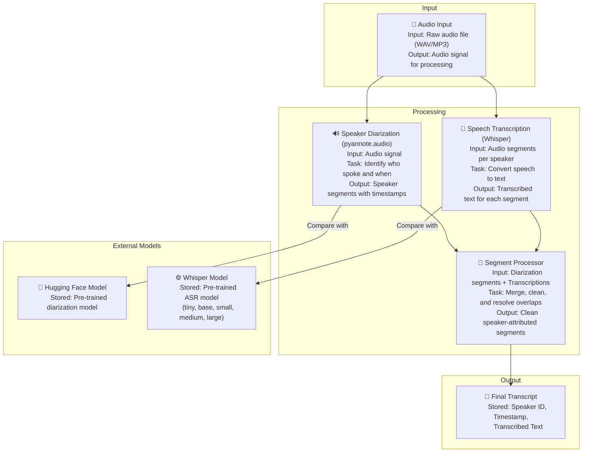

# System Architecture Diagram

```mermaid

graph TD

    %% Input
    subgraph Input
        AudioInput["🎤 Audio Input
        Input: Raw audio file (WAV/MP3)
        Output: Audio signal for processing"]
    end

    %% Processing
    subgraph Processing
        Diarization["🔊 Speaker Diarization (pyannote.audio)
        Input: Audio signal
        Task: Identify who spoke and when
        Output: Speaker segments with timestamps"]

        Whisper["📝 Speech Transcription (Whisper)
        Input: Audio segments per speaker
        Task: Convert speech to text
        Output: Transcribed text for each segment"]

        SegmentProcessor["🔄 Segment Processor
        Input: Diarization segments + Transcriptions
        Task: Merge, clean, and resolve overlaps
        Output: Clean speaker-attributed segments"]
    end

    %% External Models
    subgraph External Models
        HFModel["🤗 Hugging Face Model
        Stored: Pre-trained diarization model"]

        WhisperModel["⚙️ Whisper Model
        Stored: Pre-trained ASR model
        (tiny, base, small, medium, large)"]
    end

    %% Output
    subgraph Output
        Transcript["📄 Final Transcript
        Stored: Speaker ID, Timestamp,
        Transcribed Text"]
    end

    %% Connections
    AudioInput --> Diarization
    AudioInput --> Whisper
    Diarization -->|Compare with| HFModel
    Whisper -->|Compare with| WhisperModel
    Diarization --> SegmentProcessor
    Whisper --> SegmentProcessor
    SegmentProcessor --> Transcript

```
