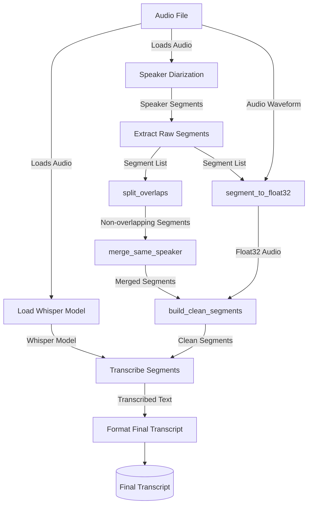

# Dataflow Diagram

```mermaid

flowchart TD
    AudioFile[Audio File] -->|Loads Audio| Diarization[Speaker Diarization]
    AudioFile -->|Loads Audio| WhisperLoad[Load Whisper Model]

    Diarization -->|Speaker Segments| ExtractSegments[Extract Raw Segments]

    ExtractSegments -->|Segment List| SegFloat[segment_to_float32]
    AudioFile -->|Audio Waveform| SegFloat

    ExtractSegments -->|Segment List| SplitOverlaps[split_overlaps]

    SplitOverlaps -->|Non-overlapping Segments| MergeSpeaker[merge_same_speaker]

    MergeSpeaker -->|Merged Segments| BuildClean[build_clean_segments]
    SegFloat -->|Float32 Audio| BuildClean

    WhisperLoad -->|Whisper Model| Transcribe[Transcribe Segments]
    BuildClean -->|Clean Segments| Transcribe

    Transcribe -->|Transcribed Text| FormatOutput[Format Final Transcript]

    FormatOutput --> Transcript[(Final Transcript)]

```
